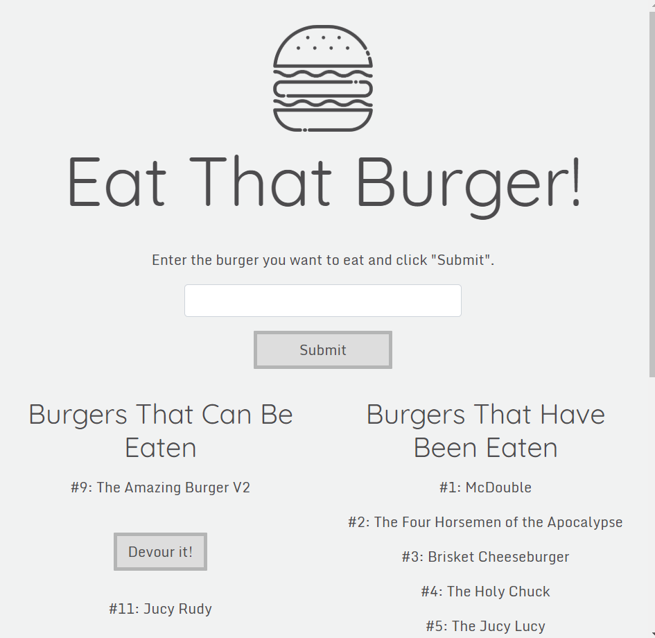

# Burger Logger

## About This Project

The goal of this app was to create an app that logs the names of burgers using MySQL, Express, Handlebars and a custom ORM. The app allows users to input the names of burgers they would like to eat, which will display on the left side of the page. If the user clicks the 'devour it' button, the burger is transfered to the 'eaten' list.

## Demo

Burger Logger is deployed to Heroku, please check it out here: [Burger Logger](https://shielded-savannah-13771.herokuapp.com/ "Burger Logger")

## Technologies Used

- Javascript
- jQuery
- Node.js
- Bootstrap
- Express.js
- Handlebars
- MySQL
- Heroku
- JawsDB (for Heroku deployment)
- HTML5 and CSS3

## Screenshots

